# PaperBanana Skills for Claude Code

<p align="center">
  <a href="https://github.com/PlutoLei/paperbanana-skill/stargazers"></a>
  
  
  
  
  
  
  <a href="https://github.com/PlutoLei/paperbanana-skill/blob/master/LICENSE"></a>
</p>

<p align="center">
  <strong>One sentence in, publication-quality academic figure out.</strong><br/>
  Powered by a 5-agent pipeline that plans, styles, generates, and self-critiques your illustrations.
</p>

<p align="center">
  <strong>English</strong> | <a href="README_CN.md">中文</a>
</p>

---

## Gallery

<table>
<tr>
<td align="center"><strong>Biology — Signal Pathway</strong><br/>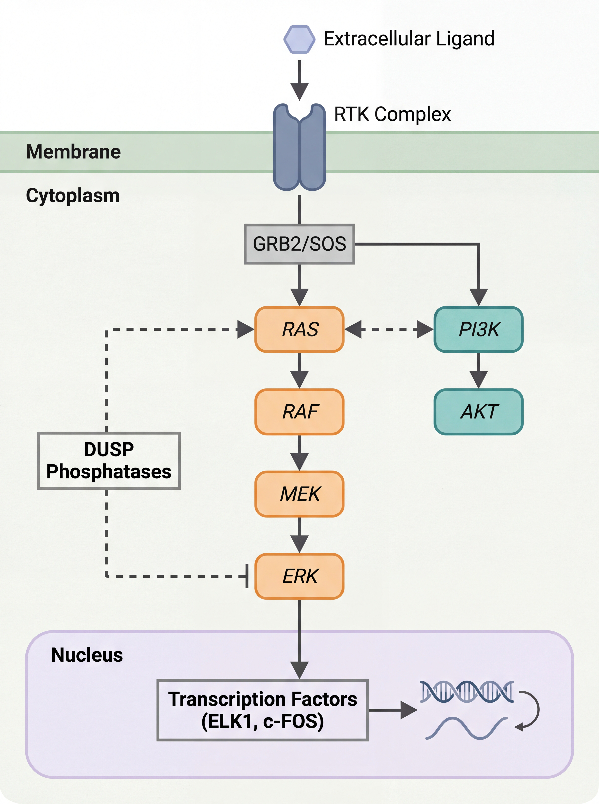</td>
<td align="center"><strong>NLP — RAG Pipeline</strong><br/>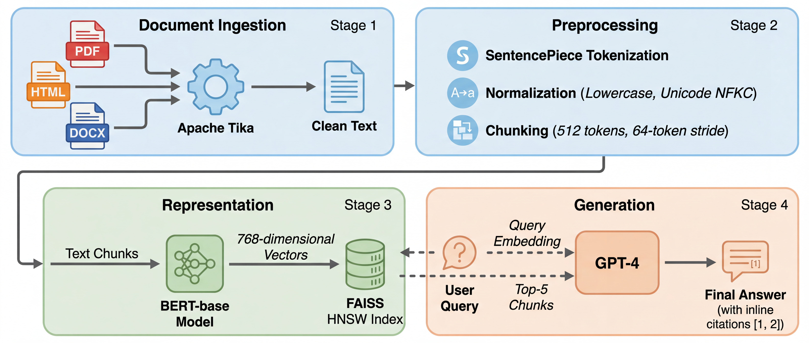</td>
</tr>
<tr>
<td align="center"><strong>Data Engineering — Lakehouse</strong><br/>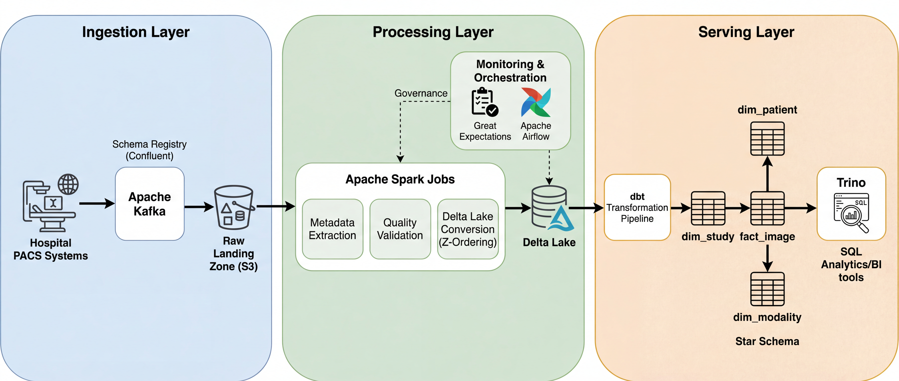</td>
<td align="center"><strong>Medical AI — U-Net + Mamba</strong><br/>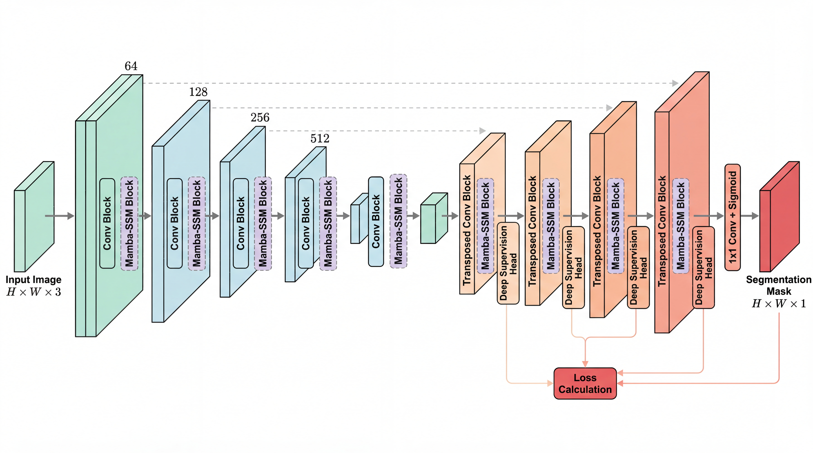</td>
</tr>
</table>

<p align="center"><em>All figures generated from plain text descriptions — zero manual drawing.</em></p>

<details>
<summary><strong>More Examples</strong> (architecture diagrams, slides)</summary>
<br/>
<table>
<tr>
<td align="center"><strong>Transformer Architecture</strong><br/>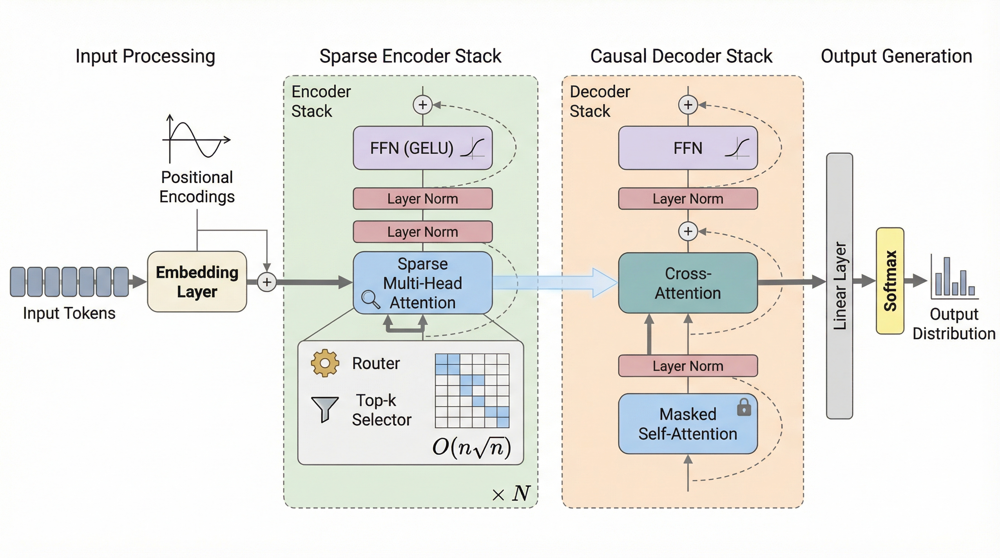</td>
<td align="center"><strong>Mamba SSM Architecture</strong><br/>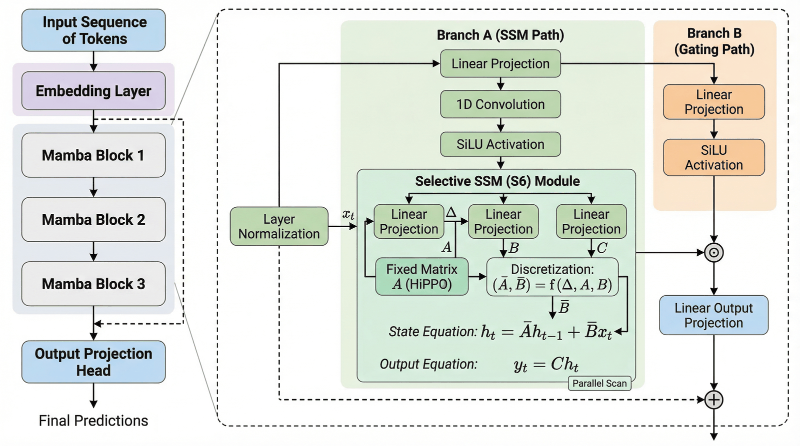</td>
</tr>
<tr>
<td align="center" colspan="2"><strong>RAG Pipeline</strong><br/>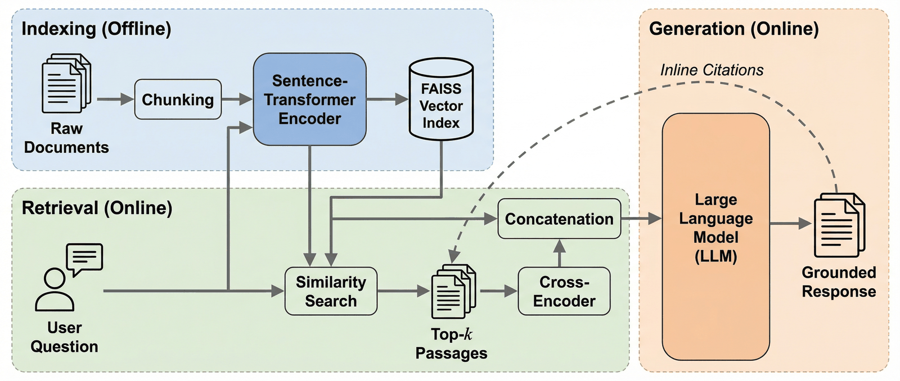</td>
</tr>
</table>
</details>

---

## Skills in this Marketplace

| Skill | Scope | Description | Version |
|-------|-------|-------------|---------|
| **paperbanana** | user | Academic diagrams, plots, slides, and quality evaluation | v4.0.0 |
| **paperbanana-slide-deck** | project | Full slide deck orchestration (RDIV workflow) + 150+ style presets | v1.1.0 |

## Feature Matrix

| Capability | Status | Details |
|------------|--------|---------|
| **GPT Image 2 native support** | ✅ **v4.3 New** | `gpt-image-2` (2026-04-21) with true 16:9 up to 2048×1152, quality tier (low/medium/high), full RDIV pipeline + Critic |
| **Smart provider routing** | ✅ **v4.3 New** | Auto-pick `openai` vs `gemini` by scenario; explicit `用 GPT`/`用 Gemini`/`两路并行` override always respected |
| Methodology diagrams | ✅ | Text → publication-quality figure in 30s |
| Statistical plots | ✅ | CSV/JSON data → auto-styled academic plot |
| Presentation slides | ✅ | Markdown → 4K slide with 150+ style presets |
| Multi-venue styles | ✅ **New** | `--venue neurips\|icml\|acl\|ieee\|custom` |
| PDF input | ✅ **New** | `--input paper.pdf --pages 3-5` |
| 6-item quality eval | ✅ **New** | Binary checklist: completeness, layout, annotation, color, legibility, hallucination |
| Autoresearch loop | ✅ **New** | Automated prompt self-optimization with keep/revert |
| Error handling | ✅ **New** | Critic UNREVIEWED status, provider fallback chains, retry filtering |
| 5 VLM providers | ✅ | Gemini, Claude, OpenAI, Bedrock, OpenRouter |
| Auto-refine | ✅ | `--auto` loops until Critic is satisfied |
| Run continuation | ✅ | `--continue` with `--feedback` for iterative refinement |
| Dynamic aspect ratio | ✅ | 8 Imagen ratios, Planner auto-recommends |

---

## What's New in v4.3 — GPT Image 2 First-Class Support

OpenAI released `gpt-image-2` on **2026-04-21**. PaperBanana v4.3 integrates it natively so the full **Retriever → Planner → Stylist → Visualizer → Critic** pipeline runs on gpt-image-2 outputs. You get quality-gated images at up to 2048×1152 without leaving paperbanana.

### Adapter upgrade

| Feature | Before (v4.2) | After (v4.3) |
|---------|---------------|--------------|
| Default OpenAI model | `gpt-image-1.5` | `gpt-image-1.5` — but `gpt-image-2` is now fully wired in too |
| Output sizes | 1024×1024 / 1536×1024 / 1024×1536 (3 sizes) | **Adds** 2048×1152 (true 16:9), 1536×1536, 1792×1024, 1152×2048 |
| `quality=low\|medium\|high` | ❌ rejected | ✅ auto-sent for gpt-image-2 |
| Supported ratios | 3 (`1:1`, `3:2`, `2:3`) | **8** (all paperbanana ratios; no more downgrade) |
| Critic loop | Only on Gemini | ✅ Runs on gpt-image-2 too — catches Chinese typo bugs, missing nodes |

Switching is a two-flag change:

```bash
python -m paperbanana.cli generate \
  --image-provider openai --image-model gpt-image-2 \
  --aspect-ratio 16:9 \
  --input prompt.txt --caption "..."
```

### Auto routing by scenario

The skill picks the right provider based on your request's signal:

| Scenario | Auto-routes to | Why |
|----------|----------------|-----|
| User says `用 GPT` / `用 Gemini` / `两路并行` | That provider (or both) | Explicit intent always wins |
| `--purpose submission` / "投稿用" | `gpt-image-2` high | Rigor priority |
| Slide deck with **Chinese titles** | `gpt-image-2` | Avoid Gemini's duplicate-character bug (see below) |
| Edit with ≥ 2 reference images | `gpt-image-2` | Avoid Gemini's multi-image hallucination |
| Prompt mentions 山水 / 书法 / 古风 / 水墨 | `gemini` | Gemini dominates traditional East-Asian aesthetics |
| `generate` with architecture / multi-stage / ablation keywords | `gpt-image-2` high | GPT wins on dense multi-module figures |
| Everything else | `gemini` medium (default) | Faster, cheaper, prettier for general work |

Routing is calibrated from a 16-prompt controlled comparison (details: `docs/superpowers/specs/2026-04-23-image-router-design.md` in the companion repo).

### Before / After — routing in action

These pairs come from the same prompt sent to both providers. The routing table exists because each model has specific strengths and specific bugs.

#### 1. Chinese slide titles — GPT wins (Gemini has a duplicate-character bug)

<table>
<tr>
<td align="center" width="50%"><strong>Gemini</strong><br/><br/><em>Title reads "飞轮模飞轮模型" — the prefix "飞轮模" is duplicated. Not viable for slide decks.</em></td>
<td align="center" width="50%"><strong>gpt-image-2</strong><br/>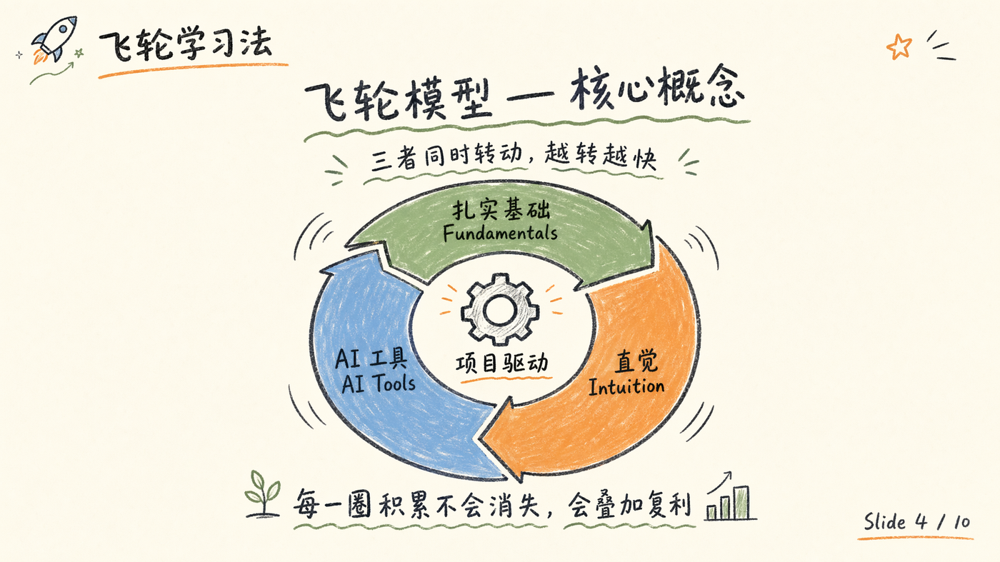<br/><em>Title renders cleanly: "飞轮模型 — 核心概念". Routing sends Chinese slides here.</em></td>
</tr>
</table>

#### 2. Semantic correctness (diffusion process) — GPT wins

<table>
<tr>
<td align="center" width="50%"><strong>Gemini</strong><br/>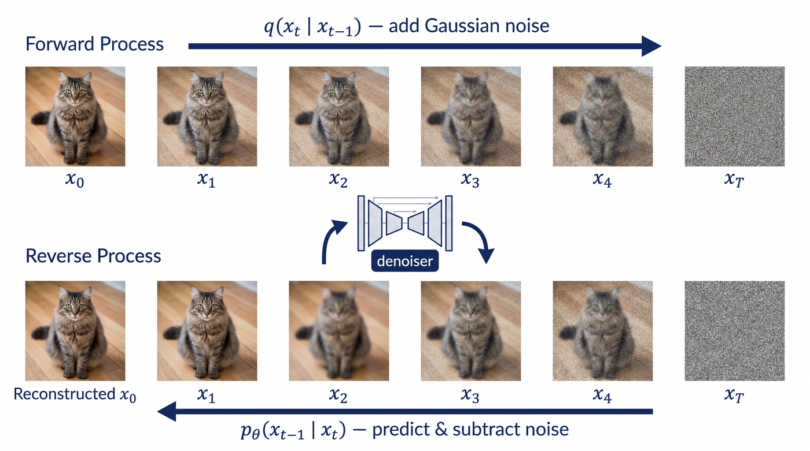<br/><em>Cat images at x_0 through x_4 look identical; only x_T is noise. Semantics and visuals don't match.</em></td>
<td align="center" width="50%"><strong>gpt-image-2</strong><br/>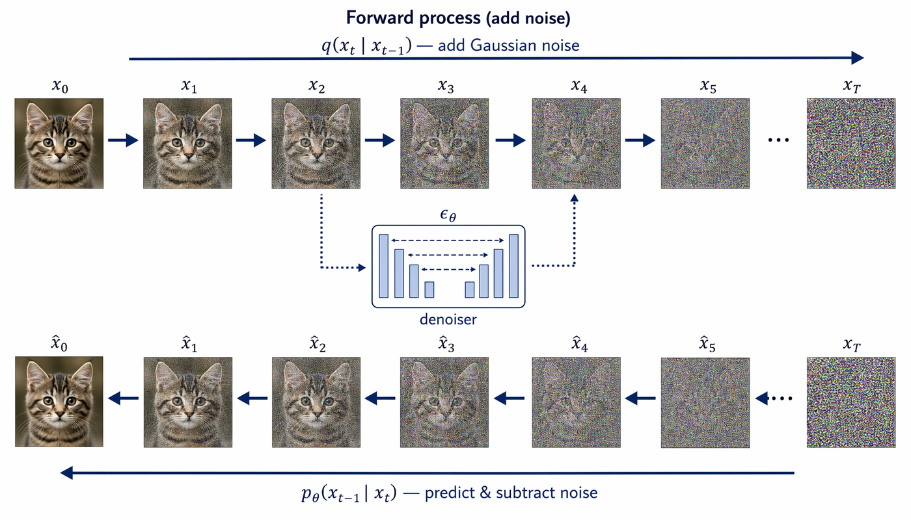<br/><em>Cat actually degrades step-by-step — visually faithful to the diffusion process.</em></td>
</tr>
</table>

#### 3. Traditional Chinese calligraphy — Gemini wins (bolder brushwork)

<table>
<tr>
<td align="center" width="50%"><strong>Gemini</strong><br/><br/><em>Bold expressive strokes with visible 飞白 and xuan-paper fiber — the prompt asked for "bold" and got it.</em></td>
<td align="center" width="50%"><strong>gpt-image-2</strong><br/><br/><em>Technically correct characters but the stroke feels restrained. The routing sends 书法/山水/古风 prompts to Gemini.</em></td>
</tr>
</table>

### Verdict

You don't need to know any of this — just ask for a figure and paperbanana picks. Or override with `--image-provider openai|gemini|both`. The Critic loop runs on whatever the pipeline picks, so quality stays gated regardless.

---

## What's New in v4.0

### Eval-First Quality System

A 6-item binary checklist evaluator that measures academic figure quality without human reference images:

| Check | Question | Pass Criteria |
|-------|----------|--------------|
| Completeness | All input concepts represented? | Every key concept has a visual element |
| Layout | Logical flow direction? | Clear L→R, T→B, or radial flow |
| Annotation | All components labeled? | Every visual element has text |
| Color Restraint | ≤3 primary colors? | Academic palette discipline |
| Legibility | Readable at 50% zoom? | Text survives PDF column layout |
| No Hallucination | Zero unlabeled concepts? | Nothing invented beyond input |

**Baseline: 76% → 100%** after prompt optimization. Color restraint was the bottleneck (33% → 100%).

### Autoresearch Self-Optimization

Automated prompt mutation loop inspired by [Karpathy's autoresearch](https://github.com/karpathy/autoresearch):

```
Mutate prompt → Generate figures → Evaluate checklist → Keep or Revert → Repeat
```

- One mutation per round (isolation principle)
- Targets weakest checklist dimension automatically
- Versioned prompt snapshots + JSONL changelog
- Stop condition: 3 consecutive rounds at 90%+ or 20 rounds max

### Multi-Venue Academic Styles

```bash
/paperbanana generate method.txt "Architecture overview" --venue neurips
```

Built-in style guides for NeurIPS, ICML, ACL, IEEE — each with venue-specific color palettes, layout conventions, and typography.

### Robust Error Handling

| Failure Type | Behavior |
|-------------|----------|
| Image API failure | Retry 3× → fallback provider chain → report |
| Critic JSON parse failure | **Never silently approve** — mark UNREVIEWED, retry once |
| Rate limit (429) | Exponential backoff, skip non-transient errors |
| Plot code injection | AST-based import blocklist (os, subprocess, socket blocked) |

---

## Quick Start

```bash
# 1. Install PaperBanana
git clone https://github.com/llmsresearch/paperbanana.git
cd paperbanana && pip install -e ".[google]"

# 2. Add the marketplace & install skills
claude plugin marketplace add PlutoLei/paperbanana-skill
claude plugin install paperbanana@paperbanana-skills
claude plugin install paperbanana-slide-deck@paperbanana-skills --scope project  # optional

# 3. Generate your first figure
# /paperbanana A 4-layer CNN with batch normalization for image classification
```

> **Note:** This repository contains Claude Code **skill definitions** (SKILL.md files). The underlying Python package lives at [llmsresearch/paperbanana](https://github.com/llmsresearch/paperbanana).

---

## Why PaperBanana?

| Pain Point | Traditional | With PaperBanana |
|------------|------------|------------------|
| Methodology figures | Hours in PowerPoint / TikZ | One sentence, 30 seconds |
| Statistical plots | matplotlib boilerplate | Describe your intent, auto-styled |
| Style consistency | Manual effort per figure | Critic agent enforces palette |
| Quality assurance | Eyeball it | 6-item binary checklist, automated |
| Venue compliance | Read style guide, guess | `--venue neurips` handles it |

---

## Pipeline Architecture

<p align="center">
  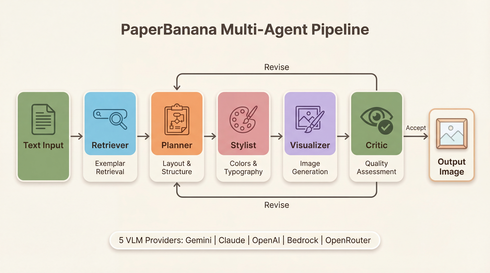
</p>

The pipeline runs iteratively: the **Critic** evaluates each output against academic quality criteria and either accepts it or sends revision instructions back to the **Planner**. Parse failures are handled safely — never silently approved.

### Slide Deck Orchestrator

<p align="center">
  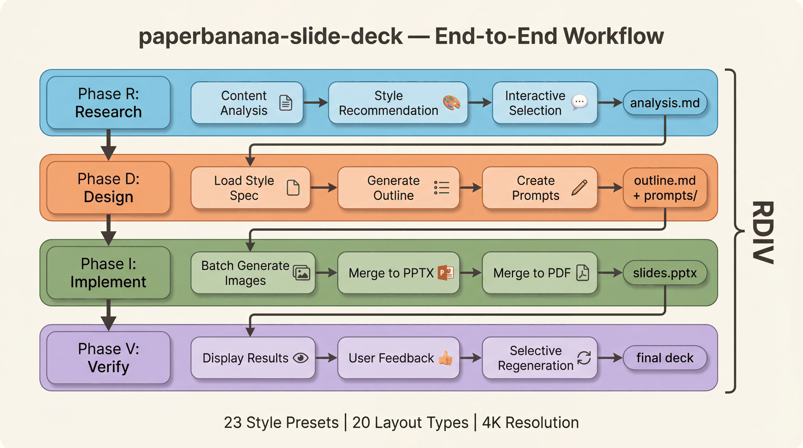
</p>

End-to-end presentation creation: analyze content → select from 23 visual styles → generate outlines → batch-generate 4K slides → merge to PPTX/PDF.

---

## Commands

| Command | Purpose | Example |
|---------|---------|---------|
| `generate` | Methodology diagrams | `/paperbanana A transformer with sparse attention` |
| `plot` | Statistical plots | `/paperbanana plot results.csv Bar chart of accuracy` |
| `slide` | Presentation slides | `/paperbanana slide prompt.md` |
| `slide-batch` | Batch slides | `/paperbanana slide-batch prompts/` |
| `evaluate` | Compare gen vs reference | `/paperbanana evaluate gen.png ref.png` |
| `data` | Manage datasets | `/paperbanana data download` |
| `setup` | Setup wizard | `/paperbanana setup` |

<details>
<summary><strong>Command Examples</strong></summary>

```bash
# Generate with venue-specific style
/paperbanana generate method.txt "Overview of the proposed framework" --venue neurips --optimize

# Generate from PDF
/paperbanana generate paper.pdf "Architecture diagram" --pages 3-5

# Auto-refine until Critic is satisfied
/paperbanana generate method.txt "Pipeline overview" --auto

# Continue with feedback
/paperbanana generate --continue --feedback "Make the arrows thicker and add color coding"

# Custom provider and aspect ratio
/paperbanana generate method.txt "Wide pipeline" --vlm-provider anthropic --aspect-ratio 16:9

# Batch generate slides with style
/paperbanana slide-batch prompts/ --resolution 4k --style ml-ai --iterations 3
```

</details>

---

## Supported Providers

| Provider | VLM | Image Generation | Setup |
|----------|-----|-----------------|-------|
| Google Gemini | Flash / Pro | Imagen 3 | `GOOGLE_API_KEY` |
| Anthropic Claude | Claude 4 | — | `ANTHROPIC_API_KEY` |
| OpenAI | GPT-4o | DALL-E 3 | `OPENAI_API_KEY` |
| AWS Bedrock | Claude / Nova | Nova Canvas | AWS credentials |
| OpenRouter | Various | Various | `OPENROUTER_API_KEY` |

**Retry policy:** Transient errors (429, 5xx) retry with exponential backoff. Auth errors (401, 403) fail immediately — no wasted retries.

---

## Installation

### Option A: Plugin marketplace (recommended)

```bash
claude plugin marketplace add PlutoLei/paperbanana-skill
claude plugin install paperbanana@paperbanana-skills
claude plugin install paperbanana-slide-deck@paperbanana-skills --scope project  # optional
```

### Option B: Manual install

```bash
# paperbanana skill (user-level)
mkdir -p ~/.claude/skills/paperbanana
curl -o ~/.claude/skills/paperbanana/SKILL.md \
  https://raw.githubusercontent.com/PlutoLei/paperbanana-skill/master/plugins/paperbanana/skills/paperbanana/SKILL.md

# paperbanana-slide-deck skill (project-level, optional)
mkdir -p .claude/skills/paperbanana-slide-deck
curl -o .claude/skills/paperbanana-slide-deck/SKILL.md \
  https://raw.githubusercontent.com/PlutoLei/paperbanana-skill/master/plugins/paperbanana-slide-deck/skills/paperbanana-slide-deck/SKILL.md
```

### PaperBanana package setup

```bash
git clone https://github.com/llmsresearch/paperbanana.git
cd paperbanana
pip install -e ".[google]"          # Gemini (default, free tier available)
# pip install -e ".[all]"           # All providers
python -m paperbanana.cli setup     # Interactive API key configuration
```

---

## Style Presets (23 available)

Use `--style <name>` with `slide` or `slide-batch`.

| Category | Styles |
|----------|--------|
| Academic | `scientific`, `biotech`, `neuroscience`, `ml-ai`, `environmental` |
| Professional | `corporate`, `minimal`, `notion`, `bold-editorial` |
| Creative | `watercolor`, `sketch-notes`, `pixel-art`, `fantasy-animation` |
| Premium | `tech-keynote`, `creative-bold`, `financial-elite` |
| Specialized | `blueprint`, `chalkboard`, `dark-atmospheric`, `vintage`, `editorial-infographic`, `vector-illustration`, `intuition-machine` |

---

## Evaluation Infrastructure

PaperBanana v4.0 includes a complete evaluation system for measuring and improving figure quality:

```
evaluation/
├── checklist.py          # 6-item binary pass/fail evaluator
├── judge.py              # VLM-as-Judge comparative evaluation
├── benchmark.py          # End-to-end benchmark harness
└── prompt_ablation.py    # A/B prompt comparison runner

scripts/
├── run_checklist_baseline.py   # Run checklist on existing outputs
└── autoresearch_loop.py        # Automated prompt optimization
```

Run your own baseline:

```bash
python scripts/run_checklist_baseline.py --output-dir outputs/ --report baseline.json
```

Run autoresearch optimization:

```bash
python scripts/autoresearch_loop.py --test-inputs data/checklist_test_set --max-rounds 10 --target 90
```

---

## Troubleshooting

| Problem | Solution |
|---------|----------|
| "API key not found" | Run `setup` or check `.env` in paperbanana directory |
| "Image generation failed" | Check provider supports image gen (Claude VLM does not) |
| "Critic parse error" | v4.0 marks output as UNREVIEWED instead of silent approval |
| Output marked UNREVIEWED | Critic couldn't evaluate — review the figure manually |
| Windows Unicode errors | Upgrade PaperBanana (`git pull` in project directory) |
| Slow generation | Use `--venue` to skip Retriever, or reduce `--iterations` |

## Contributing

Contributions welcome! See the [Contributing Guide](CONTRIBUTING.md).

## License

MIT
