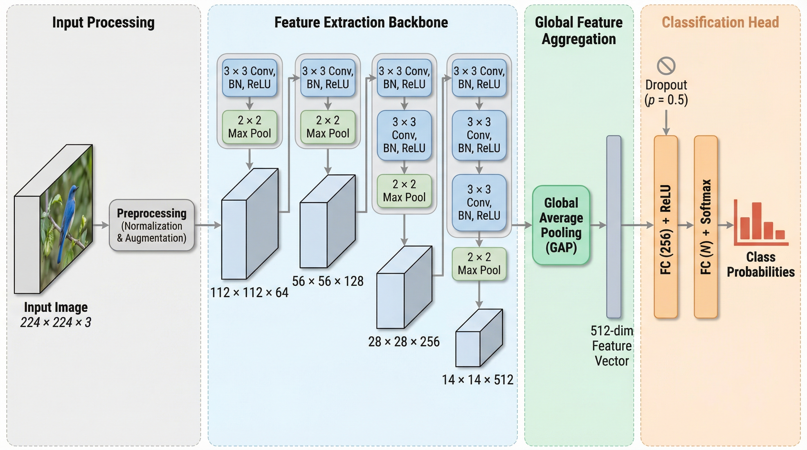
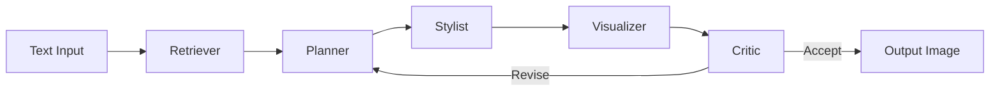

# PaperBanana Skill for Claude Code

<p align="center">
  
  
  
  
  
</p>

<p align="center">
  <strong>English</strong> | <a href="README_CN.md">中文</a>
</p>

## Gallery

<table>
<tr>
<td align="center"><strong>Transformer Architecture</strong><br/></td>
<td align="center"><strong>CNN Classification</strong><br/></td>
</tr>
</table>

> All images above were generated by PaperBanana from plain text descriptions — no manual drawing involved.

## Quick Start

```bash
# 1. Install PaperBanana
git clone https://github.com/llmsresearch/paperbanana.git
cd paperbanana && pip install -e ".[google]"

# 2. Install this skill
claude install-skill PlutoLei/paperbanana-skill

# 3. Generate your first figure
# /paperbanana A 4-layer CNN with batch normalization for image classification
```

One sentence in, publication-quality figure out. Powered by a 5-agent pipeline that plans, styles, generates, and self-critiques your academic illustrations.

## Why PaperBanana?

| Pain Point | Traditional Approach | With PaperBanana |
|------------|---------------------|------------------|
| Drawing methodology figures | Hours in PowerPoint, TikZ, or draw.io | One sentence, 30 seconds |
| Statistical plots | matplotlib boilerplate, style tweaking | Describe your intent, auto-styled |
| Style consistency | Manual effort per figure | Style guide enforced by Critic agent |
| Presentation slides | Design from scratch every time | Markdown prompt → polished slide |

## What's New in v3.0

- **5 VLM/Image providers** — Gemini, Claude, OpenAI, Bedrock, OpenRouter
- **Input optimization** — `--optimize` enriches context and sharpens captions before generation
- **Auto-refine** — `--auto` loops until the Critic is satisfied
- **Run continuation** — `--continue` resumes with `--feedback` for iterative refinement
- **Dynamic aspect ratio** — 8 Imagen ratios, Planner auto-recommends
- **Slide generation** — `slide` and `slide-batch` for presentation slides with Critic loop
- **Setup wizard** — `setup` command for guided API configuration
- **Dataset manager** — `data` command to download/manage reference sets
- **Exemplar retrieval** — `--exemplar-retrieval` for retrieval-augmented generation

## Pipeline



The pipeline runs iteratively: the Critic evaluates each output and either accepts it or sends revision instructions back to the Planner.

## Commands & Examples

| Command | Purpose | Example |
|---------|---------|---------|
| `generate` | Methodology diagrams | `/paperbanana A transformer with sparse attention` |
| `plot` | Statistical plots | `/paperbanana plot results.csv Bar chart of accuracy` |
| `slide` | Presentation slides | `/paperbanana slide prompt.md` |
| `slide-batch` | Batch slides | `/paperbanana slide-batch prompts/` |
| `evaluate` | Compare gen vs reference | `/paperbanana evaluate gen.png ref.png` |
| `data` | Manage datasets | `/paperbanana data download` |
| `setup` | Setup wizard | `/paperbanana setup` |

### Generate with optimization

```bash
/paperbanana generate method.txt "Overview of the proposed framework" --optimize --auto
```

### Plot from CSV

```bash
/paperbanana plot results.csv "Bar chart comparing F1 scores across 4 models" --optimize
```

### Generate a slide

```bash
/paperbanana slide presentation/slide_03.md --resolution 4k --iterations 5
```

### Continue a previous run with feedback

```bash
/paperbanana generate --continue --feedback "Make the arrows thicker and add color coding"
```

<details>
<summary><strong>More Examples</strong></summary>

```bash
# Generate with specific provider
/paperbanana generate method.txt "Pipeline overview" --vlm-provider anthropic --image-provider google_imagen

# Dry run to validate inputs
/paperbanana generate method.txt "Architecture diagram" --dry-run

# Custom aspect ratio
/paperbanana generate method.txt "Wide pipeline diagram" --aspect-ratio 16:9

# Batch generate all slides
/paperbanana slide-batch prompts/ --resolution 2k --iterations 3

# Evaluate with verbose output
/paperbanana evaluate gen.png ref.png --context paper.txt --caption "Figure 1" --verbose
```

</details>

## Supported Providers

| Provider | VLM | Image Generation | Setup |
|----------|-----|-----------------|-------|
| Google Gemini | Flash / Pro | Imagen 3 | `GOOGLE_API_KEY` in `.env` |
| Anthropic Claude | Claude 4 | — | `ANTHROPIC_API_KEY` in `.env` |
| OpenAI | GPT-4o | DALL-E 3 | `OPENAI_API_KEY` in `.env` |
| AWS Bedrock | Claude / Nova | Nova Canvas | AWS credentials |
| OpenRouter | Various | Various | `OPENROUTER_API_KEY` in `.env` |

Select providers per command with `--vlm-provider` and `--image-provider` flags.

## Installation

### Option A: One-command install

```bash
claude install-skill PlutoLei/paperbanana-skill
```

### Option B: Manual install

```bash
mkdir -p ~/.claude/skills/paperbanana
curl -o ~/.claude/skills/paperbanana/SKILL.md \
  https://raw.githubusercontent.com/PlutoLei/paperbanana-skill/main/SKILL.md
```

### PaperBanana setup

```bash
git clone https://github.com/llmsresearch/paperbanana.git
cd paperbanana
pip install -e ".[google]"          # Gemini (default)
# pip install -e ".[anthropic]"     # + Claude
# pip install -e ".[openai]"        # + OpenAI/DALL-E
# pip install -e ".[bedrock]"       # + AWS Bedrock
# pip install -e ".[all]"           # All providers
```

Then run the setup wizard:

```bash
python -m paperbanana.cli setup
```

Or manually create `.env` in the paperbanana directory:

```
GOOGLE_API_KEY=your-key-here
```

## Troubleshooting

| Problem | Solution |
|---------|----------|
| "API key not found" | Check `.env` file exists in the paperbanana project directory |
| "Image generation failed" | Verify your provider supports image generation (Claude VLM does not) |
| "Critic JSON parse error" | Upgrade to latest PaperBanana — 4-layer fallback fixes this |
| Windows Unicode errors | Upgrade PaperBanana (`git pull` in project directory) |

## License

MIT
