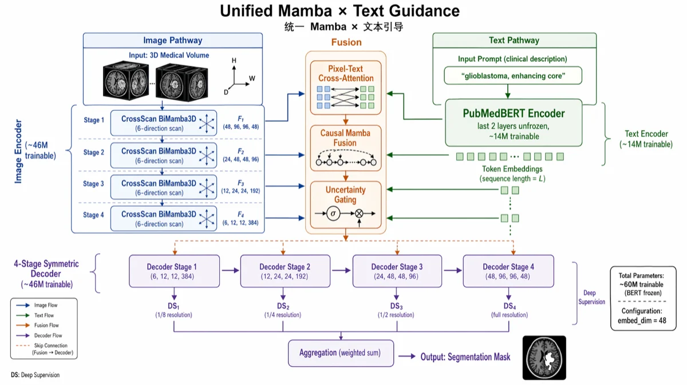
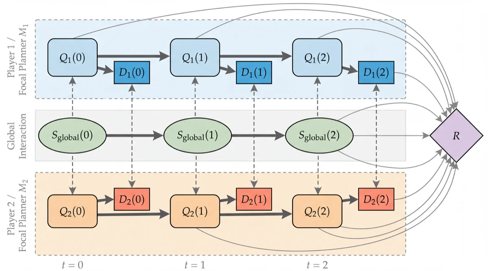
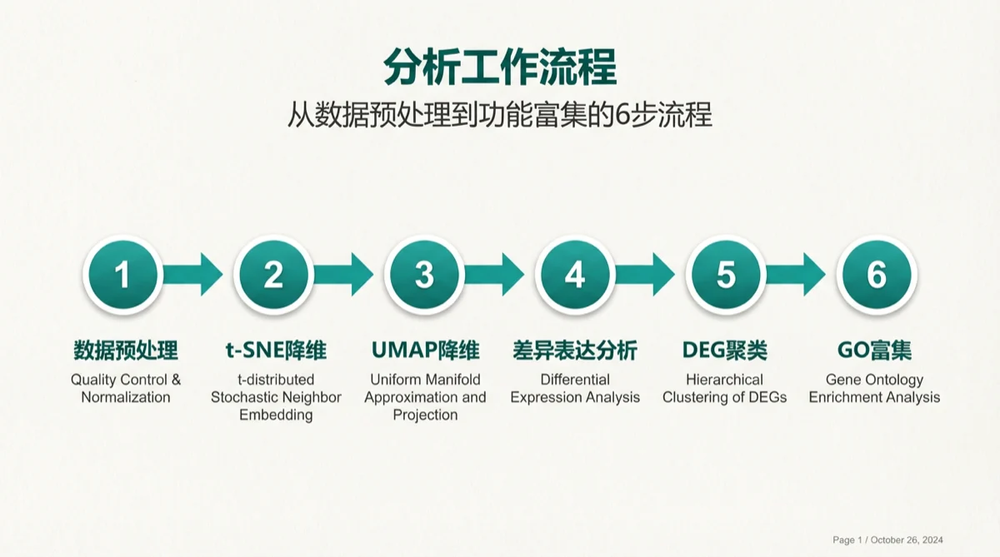
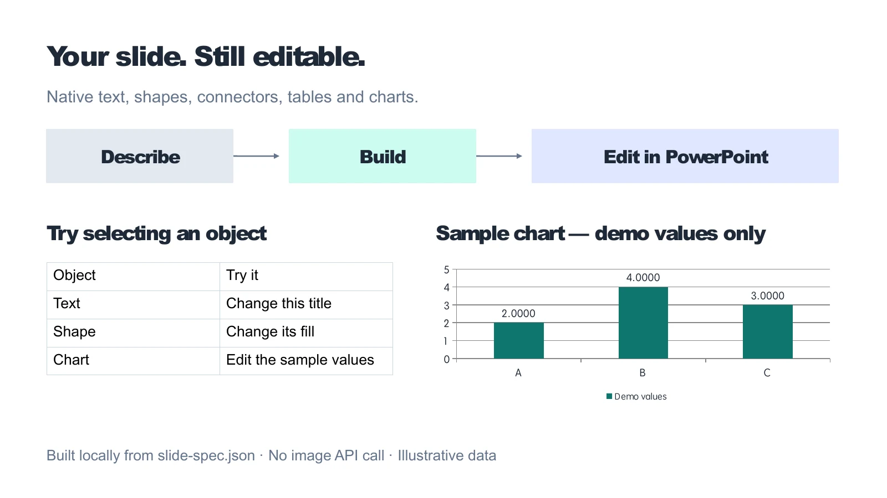

# PaperBanana Skills

**Academic figures and editable slide decks, from your agent.**

[](https://github.com/PlutoLei/paperbanana-skill/releases)
[](https://github.com/PlutoLei/paperbanana-skill/actions/workflows/validate.yml)
[](LICENSE)

**English** · [中文](README_CN.md)

[Quick start](#quick-start) · [Examples](#selected-examples) · [Documentation](#documentation)

Turn a methods description into a figure, plan a consistent slide deck, or build PowerPoint objects you can edit. Use the skills in Claude Code or Codex; choose an image backend when your task needs one.

[](examples/textmamba3d_architecture.png)

*Archived figure; the previous README records GPT Image 2. Click for the full-resolution image. [More outputs and provenance](docs/gallery.md).*

## Quick start

### 1. Install the skills

**Codex** — use the skills installer:

```bash
npx skills add PlutoLei/paperbanana-skill -a codex
```

**Claude Code** — use the plugin marketplace:

```bash
claude plugin marketplace add PlutoLei/paperbanana-skill
claude plugin install paperbanana@paperbanana-skills
```

For full deck orchestration, also install `paperbanana-slide-deck@paperbanana-skills` with `--scope project`. [Installation details and manual setup →](docs/getting-started.md)

### 2. Choose your output

| I want to… | Start here |
| --- | --- |
| Generate a figure or an image-based slide deck | Set up the [Python backend](docs/getting-started.md#python-backend) with your chosen image/VLM providers |
| Build editable PowerPoint slides | Run the [local PPTX example](examples/editable-demo/README.md); rendering needs Bun, with no image API call |
| Keep using Gemini / Vertex | Keep the existing backend and authentication setup; see [provider roles](docs/providers.md) |

### 3. Describe the task

Ask your agent:

> Use paperbanana with Gemini to draw a four-layer CNN with batch normalization. Label the input, convolution blocks and classifier; return the image and its review status.

In Claude Code you can also invoke `/paperbanana`. Name your preferred provider when you have one. [Starter prompts →](docs/prompts.md)

**Preview feature:** Codex native image routing and explicit Image 2.5 controls are on [`codex/image25-adapter`](https://github.com/PlutoLei/paperbanana-skill/tree/codex/image25-adapter), ahead of the current v4.5 release. [Setup and live smoke results](docs/providers.md#image-25-preview) describe that branch separately.

## Selected examples

<table>
<tr>
<td width="50%" valign="top"><strong>Scientific figure</strong><br/><a href="examples/game_theory_influence_diagram.png"></a><br/>Gemini · <a href="docs/prompts.md#scientific-figure">Starter prompt</a></td>
<td width="50%" valign="top"><strong>Research presentation</strong><br/><a href="examples/slide_scrna_workflow.png"></a><br/>Image slide · <a href="docs/prompts.md#research-slide">Starter prompt</a></td>
</tr>
<tr>
<td width="50%" valign="top"><strong>Consistent slide deck</strong><br/><a href="examples/slide_flywheel_04_model.png"></a><br/><a href="docs/gallery.md#slide-deck">View the set</a> · <a href="docs/prompts.md#consistent-deck">Starter prompt</a></td>
<td width="50%" valign="top"><strong>Editable PowerPoint</strong><br/><a href="examples/editable-demo/editable-demo.pptx"></a><br/><a href="examples/editable-demo/editable-demo.pptx">Download PPTX</a> · <a href="examples/editable-demo/slide-spec.json">Source spec</a></td>
</tr>
</table>

The first three are archived outputs; the PPTX is a reproducible local rendering example with illustrative data. Starter prompts are new recipes, not recovered historical inputs. [Full gallery and provenance →](docs/gallery.md)

## How it works

- **`paperbanana`** guides figure, plot and slide requests through the configured Python pipeline: retrieval, planning, styling, generation and Critic review.
- **`paperbanana-slide-deck`** plans a deck and coordinates its content and visual style. Choose image slides or native editable PPTX objects explicitly.
- **[Python backend](https://github.com/PlutoLei/paperbanana)** supplies model integrations and the generation/review pipeline. The local editable renderer lives in this repository.

The host, image provider and review provider have separate roles. A VLM integration does not necessarily generate images. [Providers, runtime support and routing →](docs/providers.md)

## Validation and limits

CI checks the skills, manifests and PPTX renderer. The [editable example](examples/editable-demo/README.md) includes a source spec and real native objects. Review generated labels, arrows, numbers and scientific claims before publication; a Critic score is an automated opinion, not scientific acceptance.

Image outputs can contain text or diagram errors. If review fails, describe the result as **unreviewed**. Historical comparisons and recent smoke tests do not establish a universal model ranking, fixed generation time or cost. [Evidence and review guide →](docs/evaluation.md)

## Documentation

| Guide | Use it for |
| --- | --- |
| [Getting started](docs/getting-started.md) | Installation, Python setup and first output |
| [Gallery](docs/gallery.md) · [Starter prompts](docs/prompts.md) | Outputs, full-resolution files and task recipes |
| [Providers](docs/providers.md) | Claude Code / Codex, Gemini / Vertex, OpenAI and preview features |
| [Styles](docs/styles.md) | Bundled styles, optional libraries and backend presets |
| [Editable PPTX](examples/editable-demo/README.md) · [Spec reference](plugins/paperbanana-slide-deck/references/editable-slide-spec.md) | Build and edit native PowerPoint objects |
| [Commands and troubleshooting](docs/usage.md) | Common commands, recovery and review status |
| [Evaluation](docs/evaluation.md) | Evidence, quality checks and limitations |
| [Changelog](CHANGELOG.md) · [Releases](https://github.com/PlutoLei/paperbanana-skill/releases) | Version history |

Current release components: marketplace **4.5.0**, `paperbanana` **4.4.0**, `paperbanana-slide-deck` **1.3.0**. These are separate component versions.

## Contributing and attribution

See the [contributing guide](CONTRIBUTING.md) and [code of conduct](CODE_OF_CONDUCT.md). Describe the runtime, provider/model and reproducible steps when reporting an issue.

Built on the [PaperBanana project](https://github.com/llmsresearch/paperbanana), with additional integrations in the [maintained Python fork](https://github.com/PlutoLei/paperbanana). See [style sources](docs/styles.md) for the preset libraries.

[MIT](LICENSE) · Maintained by [Lei Yuxuan](https://github.com/PlutoLei).
