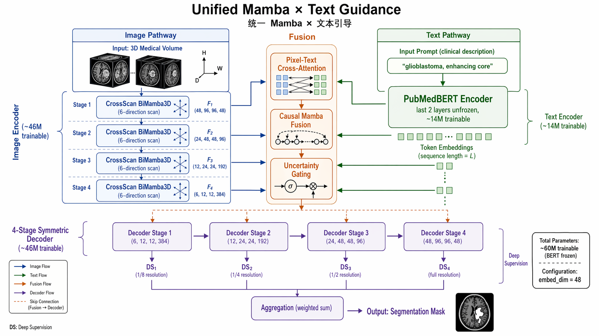
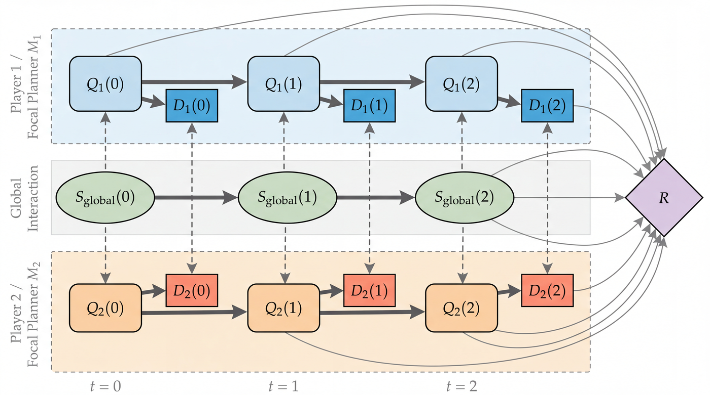
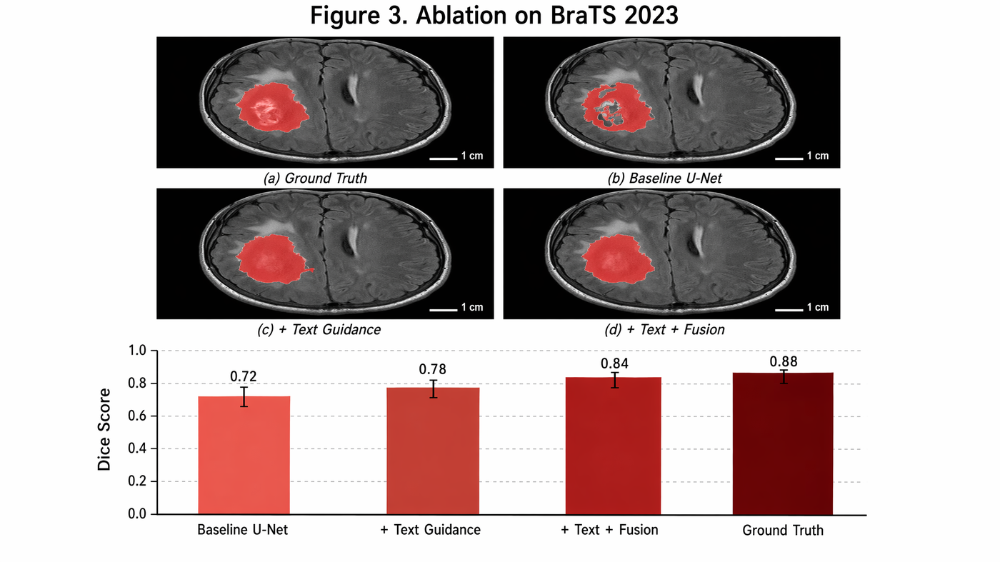
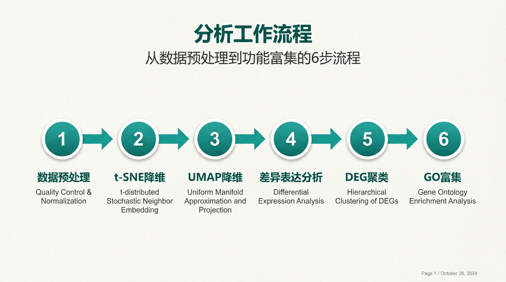

# PaperBanana — 学术插图技能集

<p align="center">
  <a href="https://github.com/PlutoLei/paperbanana-skill/stargazers"></a>
  
  
  
  
  
  
  
  <a href="https://github.com/PlutoLei/paperbanana-skill/blob/master/LICENSE"></a>
</p>

<p align="center">
  <strong>一句话输入，论文级学术插图输出。</strong><br/>
  5 智能体流水线自动规划、美化、生成、自我审查你的学术图表。
</p>

<p align="center">
  <a href="README.md">English</a> | <strong>中文</strong>
</p>

---

## 效果展示

<table>
<tr>
<td align="center"><strong>生物 — 信号通路</strong><br/></td>
<td align="center"><strong>NLP — RAG 管线</strong><br/></td>
</tr>
<tr>
<td align="center"><strong>数据工程 — 湖仓架构</strong><br/></td>
<td align="center"><strong>医学 AI — U-Net + Mamba</strong><br/></td>
</tr>
<tr>
<td align="center"><strong>医学影像 — TextMamba3D 架构</strong><br/><br/><sub><em>gpt-image-2 · 论文级信息密度</em></sub></td>
<td align="center"><strong>博弈论 — Influence Diagram</strong><br/><br/><sub><em>Gemini · 软色调学术美学</em></sub></td>
</tr>
<tr>
<td align="center"><strong>消融实验 — BraTS 2023</strong><br/><br/><sub><em>gpt-image-2 · 2×2 MRI 面板 + Dice 柱状图</em></sub></td>
<td align="center"><strong>科研幻灯片 — scRNA-seq 工作流</strong><br/><br/><sub><em>paperbanana-slide-deck · 单细胞分析流水线</em></sub></td>
</tr>
</table>

<p align="center"><em>所有图均由纯文本描述生成，零人工绘制。</em></p>

### 成套 PPT 演示 — "飞轮学习法"

由 `paperbanana-slide-deck` 生成的真实 10 张讲座幻灯片。下面 4 张展示**整套风格一致性**（同样的暖米白配色、手绘 sketch-notes 字体、齿轮主题贯穿整个 deck）。

<table>
<tr>
<td align="center"><strong>Slide 1 — 封面</strong><br/></td>
<td align="center"><strong>Slide 4 — 飞轮模型</strong><br/></td>
</tr>
<tr>
<td align="center"><strong>Slide 7 — AI 工具正误对比</strong><br/></td>
<td align="center"><strong>Slide 10 — 让飞轮转起来</strong><br/></td>
</tr>
</table>

<p align="center"><em>一条命令：<code>paperbanana-slide-deck</code> 自动选风格预设、规划大纲、起草 per-slide prompt，然后生成全套风格一致的幻灯片。</em></p>

<p align="center"><sub>同一套 pipeline 现已支持 <strong>8 个 provider</strong> 路由——这套 deck 可渲染在 <code>gpt-image-2</code>（中文标题干净）、<code>gemini</code>（快且便宜），或任意 <strong>100+ LiteLLM 后端</strong> / 本地 <code>ollama</code> 模型上，工作流不变。</sub></p>

<details>
<summary><strong>更多示例</strong>（架构图、传统艺术）</summary>
<br/>
<table>
<tr>
<td align="center"><strong>Transformer 架构</strong><br/></td>
<td align="center"><strong>Mamba 状态空间模型</strong><br/></td>
</tr>
<tr>
<td align="center" colspan="2"><strong>RAG 管线</strong><br/></td>
</tr>
<tr>
<td align="center" colspan="2"><strong>书法 — 自律</strong><br/><br/><sub><em>Gemini · 粗笔飞白 + 宣纸质感</em></sub></td>
</tr>
</table>
</details>

---

## 技能清单

| 技能 | 作用域 | 描述 | 版本 |
|------|--------|------|------|
| **paperbanana** | 用户级 | 学术插图、统计图表、幻灯片生成与质量评估 | v4.0.0 |
| **paperbanana-slide-deck** | 项目级 | 完整 PPT 编排器（RDIV 工作流）+ 150+ 风格预设 | v1.1.0 |

## 功能矩阵

| 功能 | 状态 | 说明 |
|------|------|------|
| **GPT Image 2 原生支持** | ✅ **v4.3 新** | `gpt-image-2`（2026-04-21 发布），真 16:9 到 2048×1152，quality 档位（low/medium/high），走完整 RDIV + Critic |
| **智能 Provider 路由** | ✅ **v4.3 新** | 按场景自动选 `openai` / `gemini`；用户说 `用 GPT`/`用 Gemini`/`两路并行` 永远优先 |
| 方法论插图 | ✅ | 文本 → 论文级插图，30 秒 |
| 统计图表 | ✅ | CSV/JSON → 自动美化学术图表 |
| 演示幻灯片 | ✅ | Markdown → 4K 幻灯片，150+ 种风格 |
| 多会议风格 | ✅ **新** | `--venue neurips\|icml\|acl\|ieee\|custom` |
| PDF 输入 | ✅ **新** | `--input paper.pdf --pages 3-5` |
| 6 项质量评估 | ✅ **新** | 完整性、布局、标注、配色、可读性、幻觉 |
| 自研优化循环 | ✅ **新** | Autoresearch 自动 prompt 变异 + 保留/回滚 |
| 错误处理 | ✅ **新** | Critic UNREVIEWED 状态 + provider fallback + 重试过滤 |
| 8 大 VLM 提供商 | ✅ | Gemini、Claude、OpenAI、Bedrock、OpenRouter + **LiteLLM**（100+ 后端）、**Ollama**（本地模型）、**claude_code**（经 `claude` CLI） |
| 自动精炼 | ✅ | `--auto` 循环直到 Critic 满意 |
| 运行恢复 | ✅ | `--continue` + `--feedback` 迭代式精炼 |

---

## v4.3 新增功能 — GPT Image 2 原生集成

OpenAI 在 **2026-04-21** 发布了 `gpt-image-2`。PaperBanana v4.3 把它作为一等 provider 接入，**完整 Retriever → Planner → Stylist → Visualizer → Critic 流水线** 都会作用于 gpt-image-2 出的图。你不用离开 paperbanana 就能拿到带质量门控的 2048×1152 图。

### Adapter 升级

| 维度 | v4.2 之前 | v4.3 之后 |
|------|----------|----------|
| OpenAI 默认模型 | `gpt-image-1.5` | `gpt-image-1.5`，**新增** `gpt-image-2` 原生通路 |
| 输出尺寸 | 1024×1024 / 1536×1024 / 1024×1536 | **新增** 2048×1152（真 16:9）/ 1536×1536 / 1792×1024 / 1152×2048 |
| `quality=low\|medium\|high` | ❌ 会报错 | ✅ gpt-image-2 自动带上 |
| 支持宽高比 | 3 种（`1:1`, `3:2`, `2:3`） | **8 种**（paperbanana 全集，不再强制降档） |
| Critic 循环 | 只对 Gemini 生效 | ✅ 对 gpt-image-2 也生效 — 能抓中文字 bug、漏节点 |

两个 flag 就能切：

```bash
python -m paperbanana.cli generate \
  --image-provider openai --image-model gpt-image-2 \
  --aspect-ratio 16:9 \
  --input prompt.txt --caption "..."
```

### 场景自动路由

skill 根据你的请求信号自动挑 provider：

| 场景 | 自动路由到 | 理由 |
|------|----------|------|
| 用户说 `用 GPT` / `用 Gemini` / `两路并行` | 对应 provider（或两家都跑）| 显式意图永远优先 |
| `--purpose submission` / "投稿用" | `gpt-image-2` high | 严谨优先 |
| 中文标题的**幻灯片** | `gpt-image-2` | 避 Gemini 的中文字重复 bug（见下） |
| 多参考图编辑（≥ 2 张）| `gpt-image-2` | 避 Gemini 的多图合成幻觉 |
| prompt 含 山水 / 书法 / 古风 / 水墨 | `gemini` | Gemini 在传统东亚审美上占优 |
| `generate` 含 architecture / multi-stage / ablation 关键词 | `gpt-image-2` high | GPT 在密集多模块 figure 上占优 |
| 其他 | `gemini` medium（默认）| 日常更快、更便宜、更好看 |

路由规则来自一次 16 条 prompt 的实测对比（详细记录：配套仓库的 `docs/superpowers/specs/2026-04-23-image-router-design.md`）。

### Before / After — 路由规则的实测依据

下面 3 对图出自**同一 prompt 分别交给两家模型**。路由表不是拍脑袋——每个模型有自己的强项和具体 bug。

#### 1. 中文幻灯片标题 — GPT 胜（Gemini 有字符重复 bug）

<table>
<tr>
<td align="center" width="50%"><strong>Gemini</strong><br/><br/><em>标题写成 "飞轮模飞轮模型" — 前 3 字 "飞轮模" 被重复一遍，直接废图。</em></td>
<td align="center" width="50%"><strong>gpt-image-2</strong><br/><br/><em>标题干净正确："飞轮模型 — 核心概念"。路由规则把含中文的幻灯片送到这边。</em></td>
</tr>
</table>

#### 2. 语义真实性（Diffusion 过程）— GPT 胜

<table>
<tr>
<td align="center" width="50%"><strong>Gemini</strong><br/><br/><em>从 x_0 到 x_4 的 cat 图完全一样，只有 x_T 是噪声 — 视觉和语义脱节。</em></td>
<td align="center" width="50%"><strong>gpt-image-2</strong><br/><br/><em>cat 真的按步骤加噪 — 视觉忠实于扩散过程。</em></td>
</tr>
</table>

#### 3. 传统书法 — Gemini 胜（笔力更足）

<table>
<tr>
<td align="center" width="50%"><strong>Gemini</strong><br/><br/><em>Bold expressive 笔画 + 明显飞白 + 宣纸纤维感 — prompt 要的"bold"拿到了。</em></td>
<td align="center" width="50%"><strong>gpt-image-2</strong><br/><br/><em>字形都对，但笔锋偏克制。路由规则把 书法 / 山水 / 古风 送到 Gemini。</em></td>
</tr>
</table>

### 日常使用

你不用记这些——直接要图即可，paperbanana 会自己挑。想强制就用 `--image-provider openai|gemini|both`。Critic 循环对选中的 provider 都生效，质量门控不变。

---

## v4.0 新增功能

### 评估优先的质量体系

6 项二值检查清单，无需参考图即可量化学术插图质量：

| 检查项 | 问题 | 通过标准 |
|--------|------|---------|
| 完整性 | 所有输入概念都有体现？ | 每个关键概念对应一个视觉元素 |
| 布局 | 逻辑流向清晰？ | 明确的 L→R / T→B / 放射状布局 |
| 标注 | 所有组件都有标签？ | 每个视觉元素有文字说明 |
| 配色克制 | ≤3 种主色？ | 学术级配色纪律 |
| 可读性 | 50% 缩放仍可读？ | 文字在论文双栏排版下依然清晰 |
| 无幻觉 | 零未提及概念？ | 图中不出现输入文本外的内容 |

**基线：76% → 100%**，配色克制从 33% 提升至 100%。

### Autoresearch 自优化循环

```
变异 prompt → 生成图片 → 检查清单评估 → 保留或回滚 → 重复
```

### 多会议学术风格

```bash
/paperbanana generate method.txt "架构概览" --venue neurips
```

内置 NeurIPS、ICML、ACL、IEEE 风格指南。

---

## 快速开始

```bash
# 1. 安装 PaperBanana
git clone https://github.com/llmsresearch/paperbanana.git
cd paperbanana && pip install -e ".[google]"

# 2. 安装技能（任意 runtime，自动检测 agent）
npx skills add PlutoLei/paperbanana-skill
#   或指定 runtime：npx skills add PlutoLei/paperbanana-skill -a codex
#   也可走 Claude Code 插件市场：
#   claude plugin marketplace add PlutoLei/paperbanana-skill
#   claude plugin install paperbanana@paperbanana-skills

# 3. 生成第一张图
# /paperbanana 一个带有批量归一化的 4 层 CNN 图像分类架构
```

> **提示：** 本仓库是遵循 [skills.sh 标准](https://skills.sh)的**技能定义文件**（SKILL.md），可在任意 skills-compatible runtime（Claude Code、Codex、Cursor、OpenCode 等）使用。Python 核心包在 [llmsresearch/paperbanana](https://github.com/llmsresearch/paperbanana)，两者都需安装。

---

## 提供商支持

| 提供商 | VLM | 图像生成 | 配置 |
|--------|-----|---------|------|
| Google Gemini | Flash / Pro | Imagen 3 | `GOOGLE_API_KEY` |
| Anthropic Claude | Claude 4 | — | `ANTHROPIC_API_KEY` |
| OpenAI | GPT-4o | DALL-E 3 | `OPENAI_API_KEY` |
| AWS Bedrock | Claude / Nova | Nova Canvas | AWS 凭证 |
| OpenRouter | 多种模型 | 多种模型 | `OPENROUTER_API_KEY` |
| LiteLLM | 100+ 后端 | 经后端 | `LITELLM_MODEL` / `LITELLM_API_KEY` |
| Ollama | 本地模型 | — | `OLLAMA_BASE_URL` / `OLLAMA_MODEL` |
| Claude Code | 经 `claude` CLI | — | 已登录 Claude Code（无需 key） |

---

## 常见问题

| 问题 | 解决方案 |
|------|---------|
| "API key not found" | 运行 `setup` 或检查 paperbanana 目录下的 `.env` |
| 生成失败 | 确认提供商支持图像生成（Claude VLM 不支持） |
| 输出标记为 UNREVIEWED | Critic 无法评估 — 请人工审查该图 |
| Windows 编码错误 | 升级 PaperBanana（`git pull`） |

## 贡献

欢迎贡献！详见 [贡献指南](CONTRIBUTING.md)。

## 许可证

MIT
