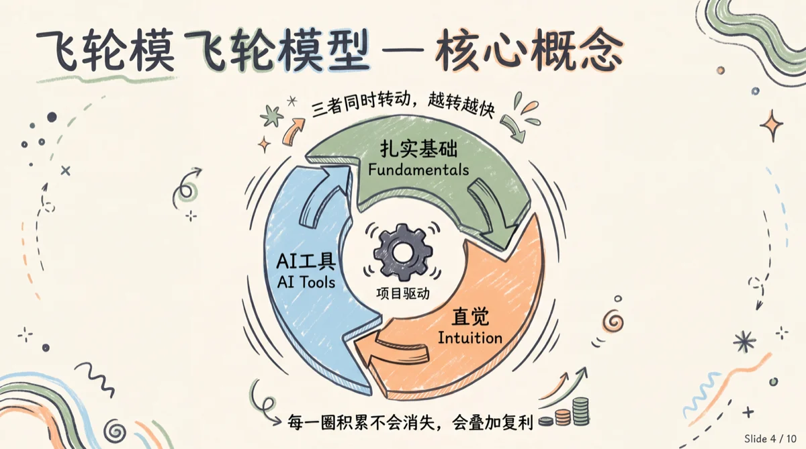
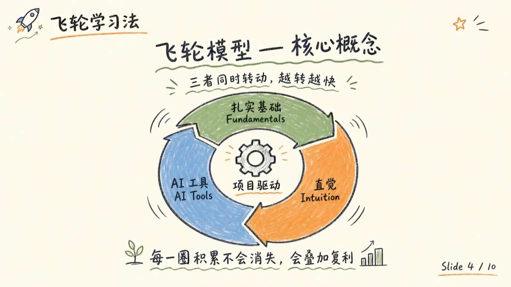
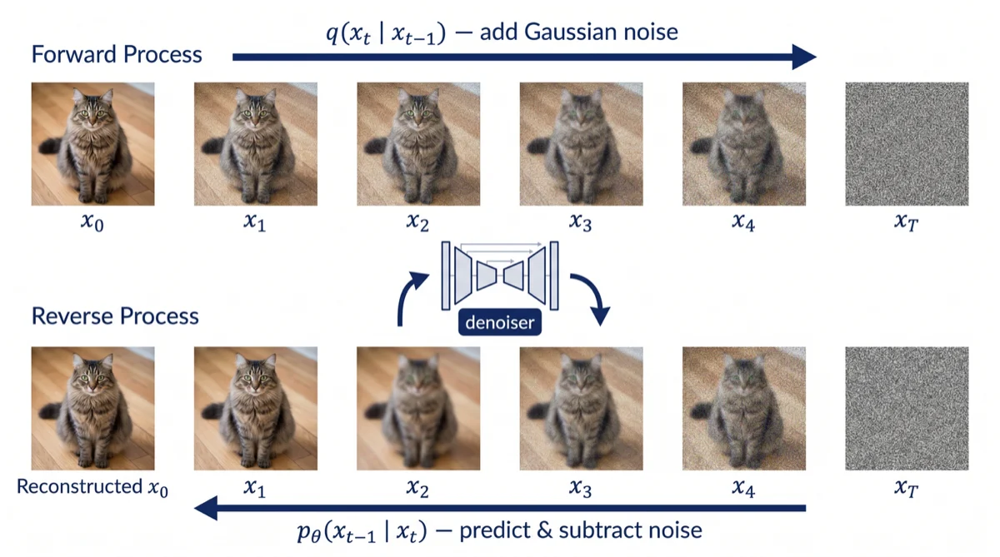
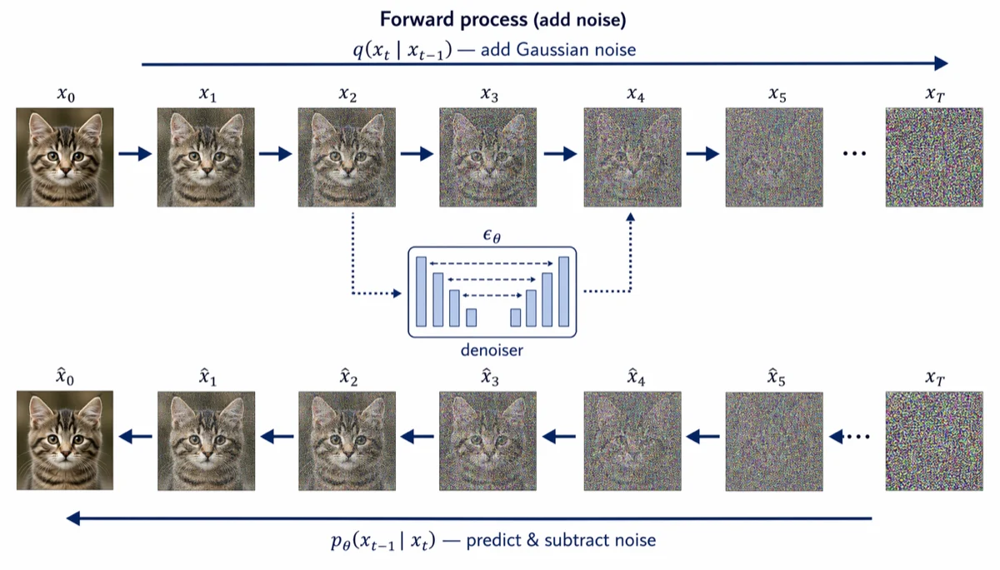
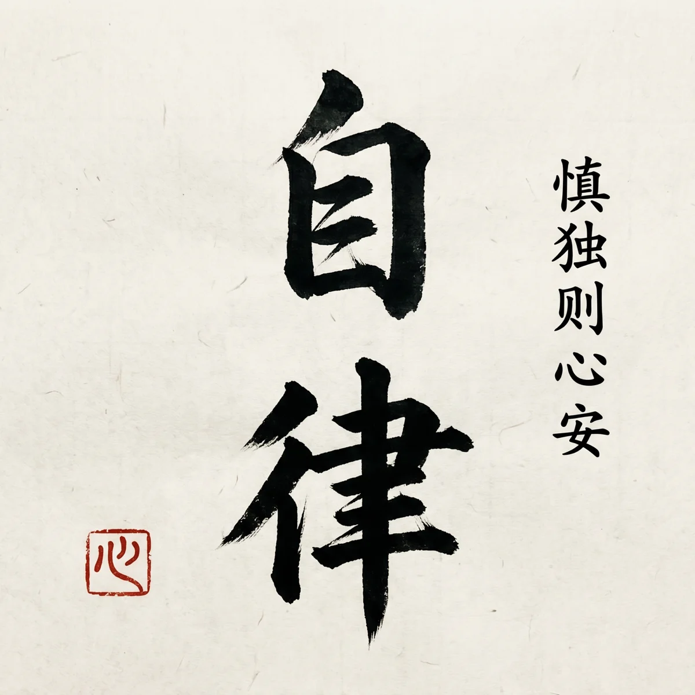
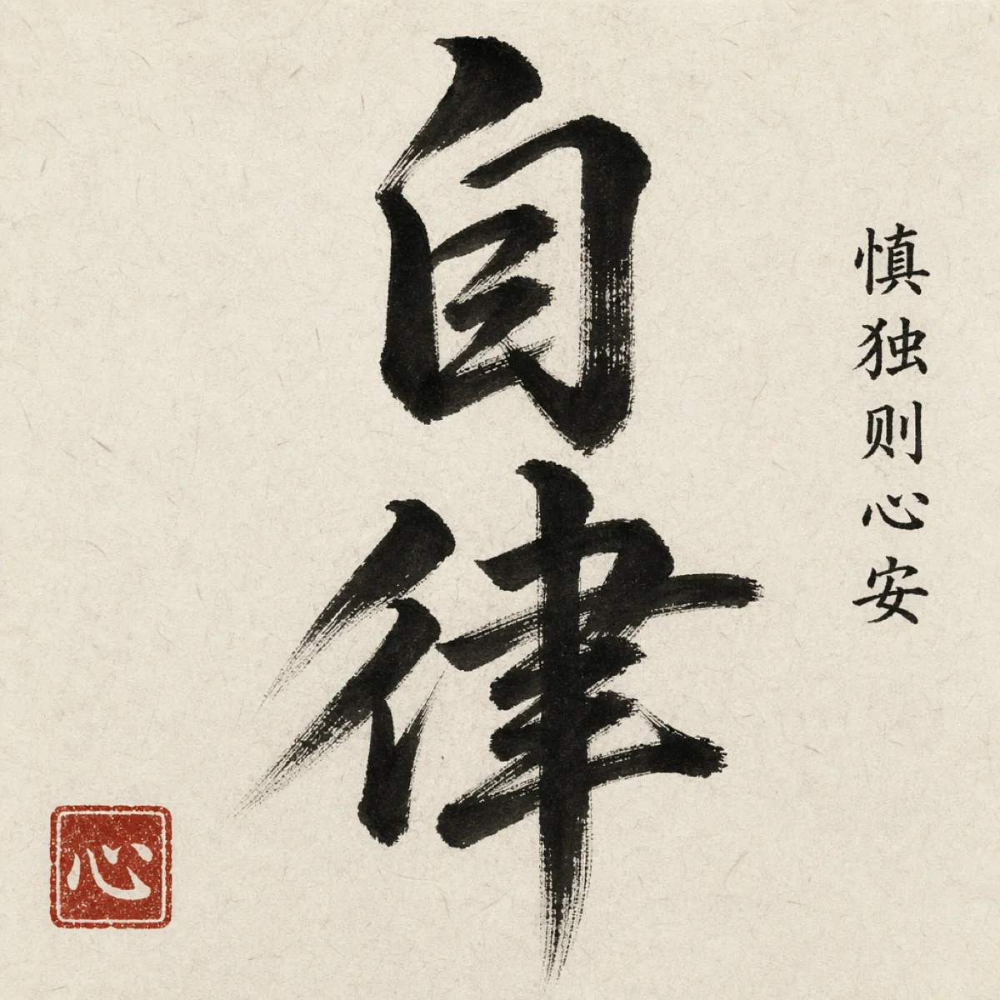

# Evidence and quality review

[Home](../README.md) · [中文说明](#中文说明) · [Gallery](gallery.md)

## What each check proves

| Evidence | Supports | Does not establish |
| --- | --- | --- |
| CI and renderer tests | Skill/manifest checks and the tested output contracts | API access, image quality, scientific correctness |
| Native PPTX parts and source spec | Editable object types in the generated example | Whether a generated figure is scientifically valid |
| Real API smoke calls | That the recorded requests returned artifacts | Universal model rankings or benchmark pass rates |
| Critic / OCR / visual checks | Findings about the inspected artifact | An error-free result across all future requests |

For figure review, check completeness, layout, annotation, color restraint, legibility and unsupported content. Inspect arrows, labels and numerical values against the actual source. For plots, preserve the supplied data. For scientific images, validate the scientific content independently of its visual polish.

A failed review leaves an image unreviewed. Recovery differs by installed backend and route; do not treat a failed or malformed Critic response as acceptance.

## Image 2.5 smoke tests

The [2026-09-09 report](https://github.com/PlutoLei/paperbanana-skill/blob/codex/image25-adapter/docs/image25-live-smoke.md) belongs to the **preview branch**, not the current v4.5 release. It records eight successful OpenAI image requests, native Codex generation/editing, the existing Gemini/Vertex route and one Critic call.

The report preserves initial masked-edit and text errors alongside prompt refinements. Outside-mask pixels were not identical; multiple references needed explicit text/script constraints. The full 24-case × 4-profile benchmark remains unrun, and billing cost is unknown. A single Critic score does not apply to the other images.

## Historical comparisons

These three pairs were previously shown in the homepage's v4.3 section. The [v4.3 changelog](../CHANGELOG.md#430---2026-04-23) attributes the wider comparison to 16 prompts across two providers in April 2026. The complete source prompts, response metadata and evaluation dataset are not included here. These retained examples support inspection of those particular outputs, not a current general ranking. Model labels below follow the old README.

### Chinese slide text

Gemini sample: the previous review identified a duplicated title prefix.

GPT Image 2 sample: the previous review found the intended title rendered without that duplication.

### Diffusion illustration

Gemini sample: the previous review noted insufficient visual change across intermediate stages.

GPT Image 2 sample: the previous review noted progressive image degradation. This is an illustrative image, not experimental evidence about a diffusion model.

### Calligraphy

Gemini sample: the previous reviewer preferred its bolder brushwork.

GPT Image 2 sample: the previous reviewer described a more restrained stroke. This preference is task- and reviewer-specific.

## Reporting measurements

When adding a performance or quality claim, link the report and include the date, sample count, inputs, model versions, relevant controls, review method and failed cases. Distinguish measured times from estimates. Keep missing cost and latency values unknown. Historical claims in the changelog retain their original context; they are not homepage service guarantees.

## 中文说明

工程测试验证文件和输出契约，真实调用验证某次请求是否获得产出，Critic、OCR 与人工检查则针对具体样例。三者不能相互替代，也不能直接推出所有任务的质量通过率。

检查学术图时，逐项核对概念是否完整、关系和箭头是否正确、标签和数值是否忠实于来源，以及缩放后的可读性。自动评审失败时说明“未评审”；不能把失败响应解释为通过。

上方历史对比保留了原图和原评论的范围，未补造缺失的提示词、模型响应或评测数据。近期 Image 2.5 记录是预览分支的功能冒烟测试，完整评测矩阵尚未执行，费用也未由账单核实。

新增“更快”“更准”等结论时，请把日期、样本量、模型版本、配置、评审方法、失败样例与报告链接放在一起。历史数字可在更新日志中查阅，不作为面向所有用户的承诺。
