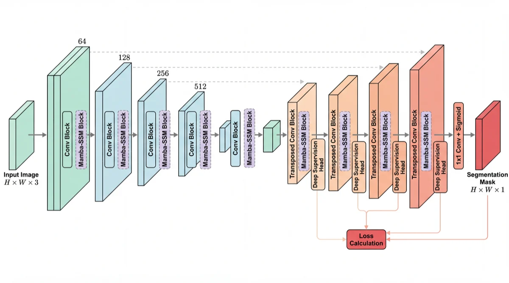
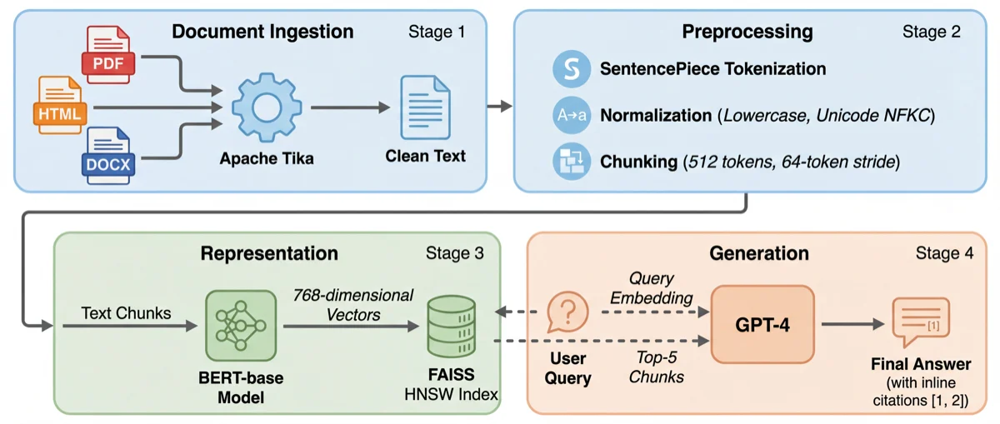
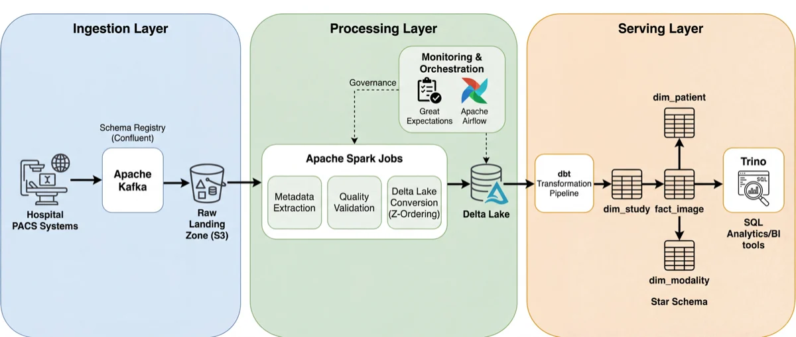
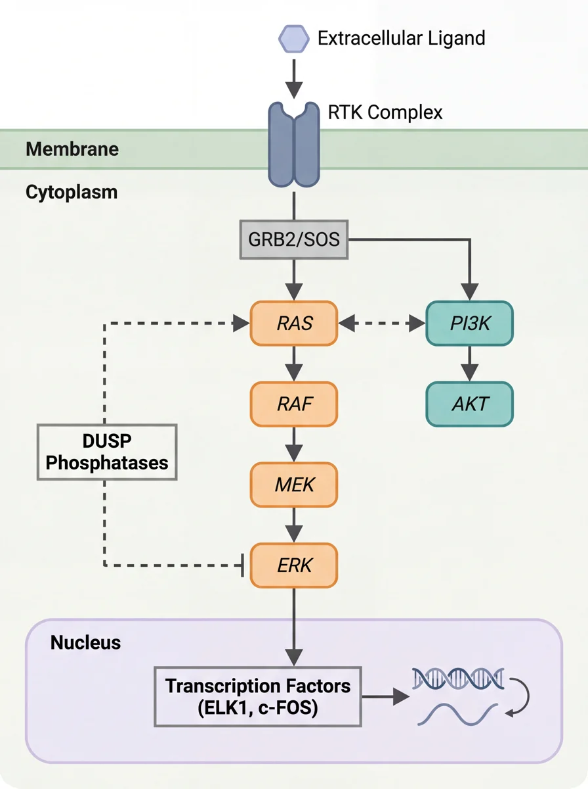
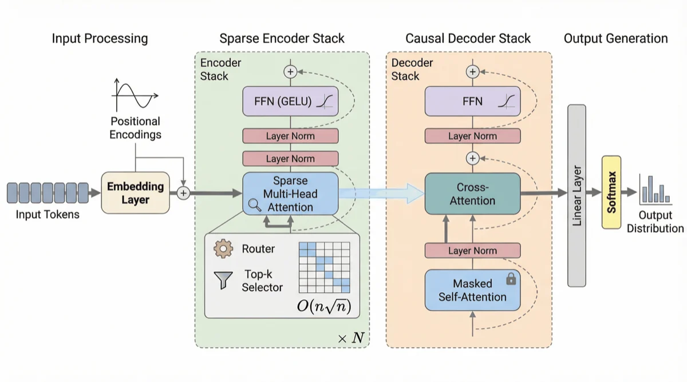
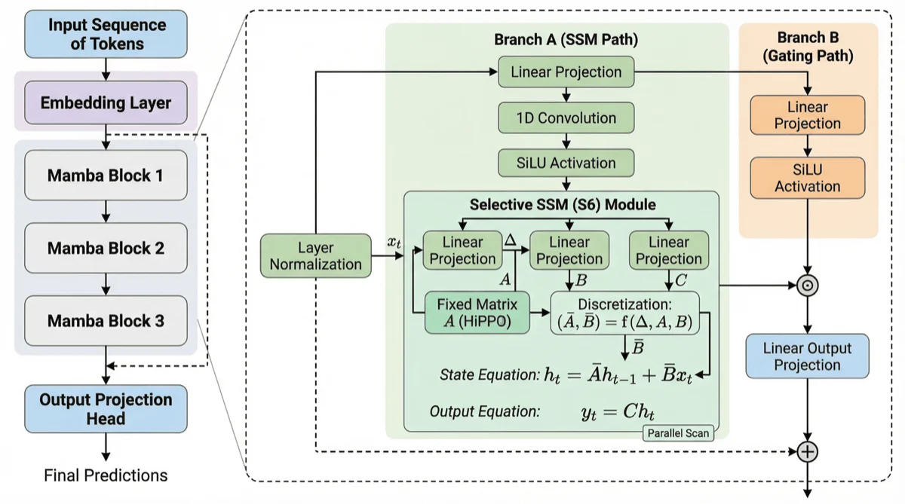
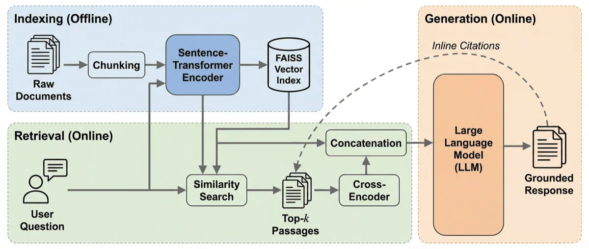
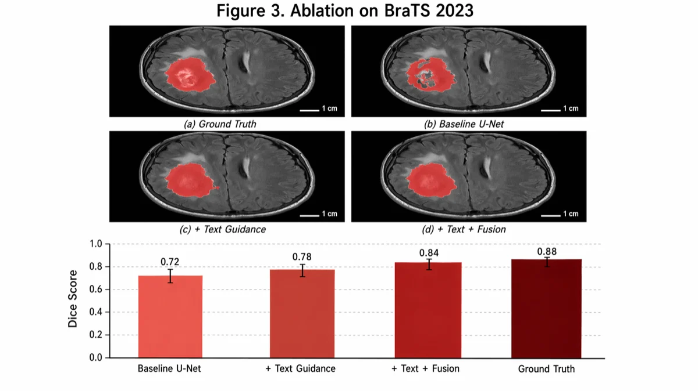
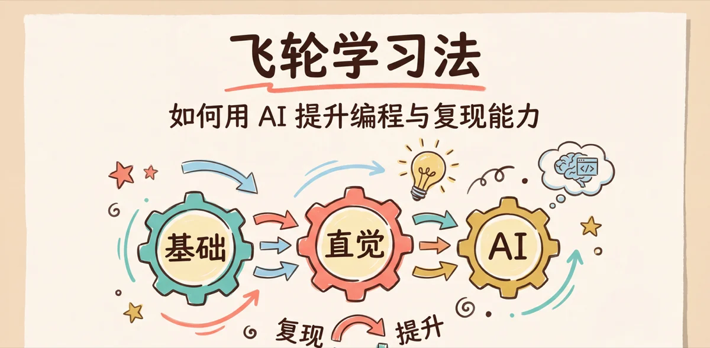

# Gallery / 完整图库

[Home / 首页](../README.md) · [Starter prompts / 起步提示词](prompts.md) · [Review evidence / 评测说明](evaluation.md)

These are the repository’s archived outputs, preserved without content edits. Model labels come from the previous README, not recovered API responses. Original prompts, complete generation settings and independent scientific validation are not available for these archived samples. Text, anatomy, values and scientific claims must be checked before reuse. Previews are compressed derivatives; click an image for the unchanged full-resolution original.

本页保留历史产出，模型标注来自原 README，不代表已找回 API 响应。历史提示词、完整生成配置与独立科学审查记录并不齐全；医学图像、数值和科学结论不能直接用作研究证据。点击预览可打开未修改的原图。新编写的起步提示词见上方链接。

## Academic figures / 学术插图

### TextMamba3D architecture / 架构图

GPT Image 2, recorded in the previous README.

### Game-theory influence diagram / 博弈论影响图

Gemini, recorded in the previous README.

### U-Net + Mamba / 分割结构

Model not recorded.

### RAG pipeline / 检索增强生成

Model not recorded.

### Lakehouse / 湖仓架构

Model not recorded.

### Biological signaling / 生物信号通路

Model not recorded.

### Transformer architecture / 架构图

Model not recorded.

### Mamba architecture / 架构图

Model not recorded.

### RAG workflow / 工作流程

Model not recorded.

### Illustrated ablation layout / 消融图排版示例

GPT Image 2, recorded in the previous README; image-generation sample, not verified experimental evidence.

## Research slide / 科研幻灯片

### Single-cell workflow / 单细胞分析流程

paperbanana-slide-deck; model not recorded.

## Slide deck

Four selected pages from the previously documented ten-slide deck. These are image slides, not the editable PPTX example below.

原记录为十页演示，此处保留其中四页；它们是图片式幻灯片，与下方原生 PPTX 示例分开。

### Flywheel learning: cover / 飞轮学习法：封面

Archived image slide; model not recorded.

### Flywheel learning: model / 飞轮学习法：模型

Archived image slide; model not recorded.

### Flywheel learning: AI tools / 飞轮学习法：AI 工具

Archived image slide; model not recorded.

### Flywheel learning: summary / 飞轮学习法：总结

Archived image slide; model not recorded.

## Traditional aesthetics / 传统艺术

### Calligraphy: 自律 / 自律书法

Gemini, recorded in the previous README.

## Editable PowerPoint / 可编辑演示

New local renderer example, with arbitrary demonstration data and no image API request. [Build instructions, source and PPTX](../examples/editable-demo/README.md).

本次新建的本地渲染示例，数值仅供演示，不调用生图 API。[构建步骤、源文件和 PPTX](../examples/editable-demo/README.md#中文说明)。

## Preview files / 预览资源

[Preview manifest](../examples/previews/manifest.json) records the original file hashes and compressed sizes. Historical model comparisons are retained with their limitations in [evaluation notes](evaluation.md#historical-comparisons).
